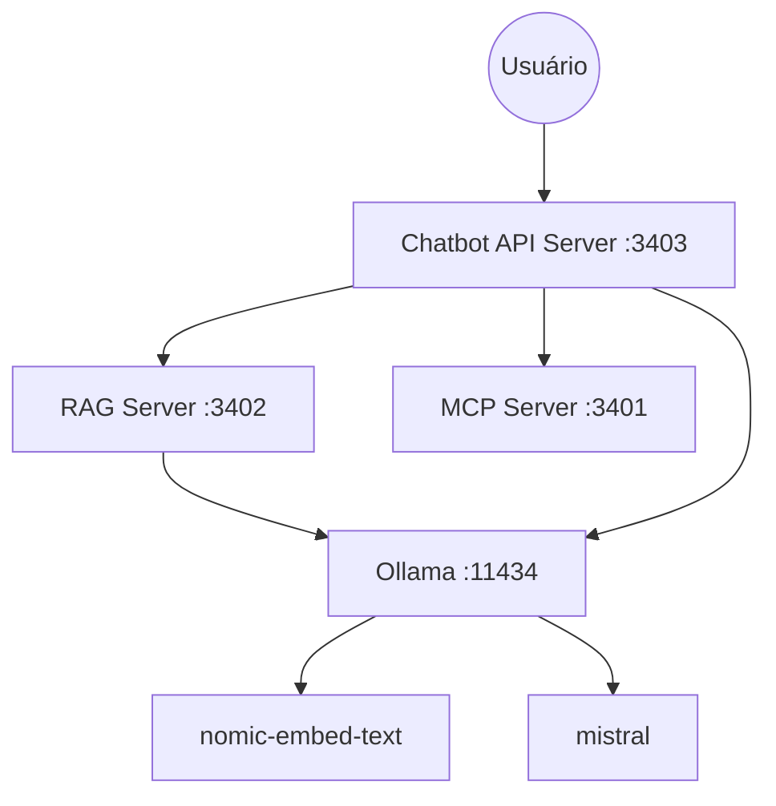

# Sistema RAG para Base de Dados Acadêmica

Este repositório contém o **RAG Server**, um componente essencial do ecossistema de assistência acadêmica. O sistema utiliza a técnica de RAG (*Retrieval-Augmented Generation*) para permitir a busca e recuperação semântica de documentos acadêmicos através de embeddings vetoriais, fornecendo contexto relevante para modelos de linguagem (LLMs).

## 🌐 Ecossistema

Este projeto faz parte de um ecossistema integrado composto por três repositórios principais:

1.  **RAG Server (Este repositório):** Gerencia a base de dados vetorial, processa documentos Markdown e fornece uma API para busca semântica.
    -   [GitHub](https://github.com/TiagoTi/rag-academia-server)
2.  **MCP Server (Model Context Protocol):** Fornece ferramentas específicas para consulta de exercícios físicos e grupos musculares via protocolo MCP.
    -   [GitHub](https://github.com/TiagoTi/mcp-academia-server)
3.  **Chatbot API Server:** Atua como o orquestrador central, integrando as respostas do RAG e do MCP com o Ollama para gerar respostas finais ao usuário.
    -   [GitHub](https://github.com/TiagoTi/chat-academia-server)

### Arquitetura do Sistema



---

## 🚀 Funcionalidades

-   **Busca Vetorial**: Realiza busca semântica utilizando similaridade de cosseno em embeddings de documentos.
-   **Ingestão de Documentos**: Processamento automático, fragmentação (*chunking*) e limpeza de documentos em formato Markdown.
-   **API REST**: Endpoint HTTP para consulta de documentos similares.
-   **Banco de Dados SQLite**: Armazenamento eficiente e local para documentos e seus respectivos vetores.
-   **Integração com Ollama**: Utilização de modelos como `nomic-embed-text` para geração de representações vetoriais.
-   **Dockerizado**: Pronto para deploy em containers com persistência de dados.
-   **TypeScript & Bun**: Desenvolvido com TypeScript e otimizado para o ambiente de execução Bun.

---

## 🛠️ Pré-requisitos

Antes de iniciar, certifique-se de ter instalado:

1.  **Bun**: Runtime JavaScript/TypeScript ([Instalação](https://bun.sh/))
2.  **Ollama**: Para execução local de modelos de IA ([Instalação](https://ollama.ai/))
    -   Execute: `ollama pull nomic-embed-text:latest`
3.  **Docker** (Opcional, para execução em container)

---

## 📦 Instalação e Configuração

### 1. Clonar e Instalar

```bash
git clone https://github.com/TiagoTi/rag-academia-server.git
cd rag-academia-server
bun install
```

### 2. Preparação de Documentos

Para alimentar o sistema com conhecimento:

1.  Coloque seus arquivos `.md` na pasta `arquivos/novos/`.
2.  Gere os embeddings executando:
    ```bash
    bun run insert-embeddings.ts
    ```

**O que este script faz:**
- Lê os arquivos em `arquivos/novos/`.
- Fragmenta o conteúdo em partes menores.
- Gera os vetores (embeddings) via Ollama.
- Salva tudo no arquivo `embeddings.sqlite`.
- Move os documentos originais para `arquivos/processados/`.

---

## 🔌 Executando o Servidor

### Localmente

Inicie o servidor de API:

```bash
bun run api.ts
```

O servidor estará disponível em `http://localhost:3000` (ou na porta definida pela variável `PORT`).

### Via Docker

#### Construção da Imagem:
```bash
docker build --pull -t rag-server-academia .
```

#### Execução do Container:
```bash
docker run \
  --restart=always \
  --name rag-server-academia \
  --network host \
  -d \
  -v $(pwd)/embeddings.sqlite:/tmp/embeddings.sqlite \
  -e OLLAMA_BASE_URL=http://localhost:11434 \
  -e DB_PATH=/tmp/embeddings.sqlite \
  rag-server-academia
```

---

## 📄 Referência da API

### `POST /api/embeddings`

Busca os trechos de documentos mais relevantes para um determinado texto.

**Exemplo de corpo da requisição:**

```json
{
  "prompt": "Quais são as orientações para treino de hipertrofia?",
  "topK": 3,
  "limiarSimilaridade": 0.5
}
```

**Exemplo com cURL:**

```bash
curl -X POST http://localhost:3000/api/embeddings \
  -H "Content-Type: application/json" \
  -d '{"prompt": "hipertrofia", "topK": 2}'
```

---

## ⚙️ Variáveis de Ambiente

| Variável | Descrição | Padrão |
|----------|-----------|---------|
| `PORT` | Porta do servidor API | `3000` |
| `DB_PATH` | Caminho do banco SQLite | `./embeddings.sqlite` |
| `OLLAMA_BASE_URL` | URL da API do Ollama | `http://localhost:11434` |

---

## 🔍 Solução de Problemas

-   **ECONNREFUSED 127.0.0.1:11434**: O Ollama não está rodando ou não está acessível. Se estiver no Docker, utilize `host.docker.internal` ou o IP da rede host.
-   **Model not found**: Certifique-se de que executou `ollama pull nomic-embed-text`.
-   **Database locked**: Verifique se não há múltiplos processos tentando acessar o arquivo `embeddings.sqlite` simultaneamente.

---

## 📝 Licença

Este projeto é licenciado sob a licença MIT.
